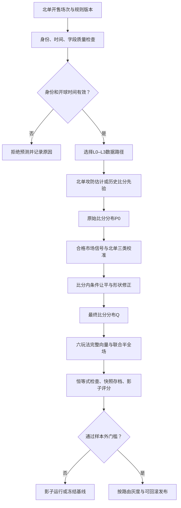

# 北单独立预测模型 BD-1：算法、验证与实施规范

版本：设计稿 BD-1.0，2026-10-09。状态：设计中的 L3 根先验、独立影子运行和快照审计已在 `beidan_bd1/` 原型实现；L0–L2、参数校准、严格赛前 walk-forward 与生产验收仍未完成。

本文件包含任务书要求的四项交付：完整算法框架（流程、数学表达、参数表）、与v2.8的差异、逐模块验证方案、P0/P1/P2路线图。以用户提供的两个压缩包为输入事实边界，不假设另有可用数据源。本文是可实施的模型设计，不是已上线引擎或已证实的精度提升报告。

## 1. 设计结论与证据边界

BD-1采用独立的北单编排器、数据分层、参数仓、校准器、概率输出及验证账本。允许复用经过数学验证的Poisson、Dixon–Coles和聚合基础，但不再调用竞彩完整predict()后追加北单诊断字段。

所有赛果玩法从一个最终全场比分分布Q以及一个与Q严格相容的半全场联合分布J生成。平局和让平修正必须改变Q；不得只改变首选置信度，也不得在聚合后分别篡改玩法概率。

### 1.1 已核对材料

- 主任务：README_GPT_BEIDAN.md。
- 诊断：beidan-diagnosis-2026-10-09.md。
- 实际数据：补充包DATA_SOURCES.md；低级别数据调研文档。
- 代码：v2.8的predictor.py、strengths.py、poisson.py、market.py、letdraw.py、fusion.py、elo.py、backtest.py及三个beidan模块。
- 版本记录：docs/model-v28-changelog.md；现有算法文档。

材料中的数据规模、额度、源覆盖范围为交付方报告，未在本次检查中重新访问用户服务器或供应商账户验证。

### 1.2 不能把诊断线索直接当参数

| 输入结论 | 可以支持什么 | 不能支持什么 |
|---|---|---|
| 13/31方向命中、模型41.9%对市场25.8% | 值得保留独立模型并扩大验证 | 已确认稳定alpha、降低所有市场权重 |
| 分歧场模型对7、市场对2 | 若这9场确为配对命中不一致，精确McNemar双侧p=0.1796875 | 单期已经显著优于市场 |
| 本期9/31平局、29% | 检查平局概率与赛事构成 | 每场平局概率固定29%、必须首选平局 |
| 8期1665场让平率28.7% | 审计后估计北单总体/分层结果先验 | 把每场让平直接改成28.7% |
| 38/69因数据不足跳过 | 必须建立缺失数据回退，评估全池覆盖 | 在已预测31场上的效果可外推到全部69场 |
| 期望总进球历史偏差−0.008 | 不支持为了显大统一抬λ | 均值无偏就代表尾部、联赛子组及比分形状全部正确 |

诊断报告的“主因60%、样本25%”没有因果分解过程，不用作模型权重。9场平局全部未被首选命中，也不等于平局概率被低估：必须比较每场P(D)及其合计、平局Brier与可靠性曲线。

市场基线Brier约0.812，明显差于三类均匀基线2/3。首先审计市场定义、让球线、主客顺序、采集时间以及是否混入开奖SP；不能把数据错配造成的差距当alpha。

### 1.3 对v2.8的新增核对

本次运行包内114项相关测试：110通过、4失败。两项失败因test_beidan固定2026-10-07开球时间已过期；两项因交付包未包含scripts/jingcai_format.py。不是全项目全量通过证明，包内也没有可重跑完整回测的数据。

已确认四项修复进入代码，但仍有残留：

1. **Shin仍需修正。** v2.8已去掉预归一，但根式中仍缺booksum B。标准候选形式见第5节。赔率(2,3,4)，当前代码输出(0.477649,0.304256,0.218094)，按带B的公式求根得到(0.469414,0.306069,0.224517)。必须以参考实现及固定样例检验，而不是仅断言“不同于等比”。
2. **让平投影仅是必要条件。** rq=−1时，让胜+让平必须等于主胜；rq=+1时，让负+让平必须等于客胜。当前代码只约束≤。λ=(1.3,0.2)、ρ=−0.13时，主胜0.651552，单独修正后的让胜+让平0.633077，相差1.85pp，仍不可能来自同一全场分布。
3. **半场输出仍可能不相容。** v2.8重加权了半全场九格，但独立half_time输出仍用原始λ；两者半场边际未统一。网格外保留原联合尾部也会带来近似误差。BD-1用同一支持集构造J。
4. **未知主客场不应等同真实中立场。** v2.8将缺失/非法venue按N参与，修好了丢弃，但新链路要保留UNKNOWN和NEUTRAL的区别。
5. **防泄漏还不完整。** 当前只检查snapshot≤kickoff，缺少snapshot≤asof、字段级available_at、历史比赛结果在预测时已可得等校验。

这些是对当前包代码的复现结论，不证明上一版部署一定使用了相同文件。

## 2. 实际数据源与特征契约

“存在一个数据源”不等于“某场有该字段”。每个字段必须携带source、source_match_id、observed_at、available_at、status、schema_version及匹配证据。没有采前存档的当前网页，不能冒充历史时点快照。

### 2.1 15个每日源：允许用途与降级

| # | 用户清单中的源 | 当前可用类型 | BD-1用途 | 禁止假设/限制 |
|---|---|---|---|---|
| 1 | API-Football | 当日/明日赛程比分、积分榜 | 赛程对齐、历史结果增量、结算交叉核对 | 100次/天与AF predictions共享；非低级别全覆盖 |
| 2 | football-data.org | 赛程、积分榜 | 可覆盖赛事的基础数据备源 | 不假定所有北单赛事有数据 |
| 3 | The Odds API | h2h/spreads/totals | 赛前三向赔率；大小球/亚盘可选观测 | 清单500次/月；必须只查映射成功的开售场次，缺失不插值成真数据 |
| 4 | AF predictions | 第三方三向概率 | P2增量候选或分歧诊断 | 不称“独立事实”；与其他模型/赔率可能相关；共享配额 |
| 5 | football-charts | J2/K1/K2历史比分增量 | 对应联赛历史样本 | 不能用于不覆盖赛事；免费状态以账户/接口实测为准 |
| 6 | ESPN | 每队近10场、含主客 | 近期战绩重要输入 | 只有10场不是完整赛季；需赛事/开球对齐 |
| 7 | Matchbook/Smarkets | 买卖中点赔率、交易量 | P2市场质量特征 | 清单明确影子，不默认接入概率；中点不是已成交价 |
| 8 | transfermarkt | 静态伤停、身价 | 当前可核对资料与缺失标注 | 抓取日期不等于缺阵确认时间；不用现时伤停回填过去 |
| 9 | betexplorer | 静态15联赛赛程赔率 | 匹配成功后的备用市场快照 | 当前静态记录不自动具备历史available_at |
| 10 | footystats | 静态296队xG | P2有时间戳、有球队匹配的可选特征 | 无覆盖/无时点则缺失，不能推广到全部北单 |
| 11 | 澳客okooo | 对阵、北单SP | 北单期号/场号/主客/让球/官方项目映射 | 与#15可能同源重复；赛前SP与开奖SP必须区分 |
| 12 | 7M/qim | 时间、战绩、亚盘、天气、阵容、H2H、积分榜 | 低级别基础特征与来源交叉核验 | 无大小球；不能从亚盘凭空生成大小球 |
| 13 | FotMob | 9个低级别联赛基础数据 | 对应范围赛程、近况、积分榜 | 当前文档明确不供赔率/亚盘/伤停；阵容名单不等于实时首发 |
| 14 | Titan007 | H2H、30场战绩、多家欧指/亚让/大小球/天气 | 近期历史及市场快照备用 | 会员模块不访问；断连走降级；不假定每场都有大小球 |
| 15 | beidan_sp | 北单SP | 标准化北单赛前参考SP/结算字段 | 审计实际底层来源，与#11/#官方500避免重复计信号 |

统一计费与失败账本：同一源的赛程/第三方预测共享额度；#11与#15同源字段只计一次。抓取失败、匹配失败、权限限制、字段不存在分别编码，不归为一个空值。

### 2.2 历史与官方SP源

| 源 | 可用角色 | 验证边界 |
|---|---|---|
| FsAPI：680K场/928竞赛 | 历史赛程比分、建模和冷启动先验候选 | 清单明确无赔率；先审计常规时间/加时、重复比赛、日期、球队ID；不能替代历史赔率 |
| football-data.co.uk：17欧洲联赛 | 对应覆盖的历史比分/赔率 | 赔率需识别初盘、收盘和市场定义；不能代表所有低级别杯赛 |
| hidden_backfill_jingcai.jsonl：419场 | 已有竞彩回测对照 | 非北单生产验证集；本包不含此数据文件 |
| 北单8期1665场结果 | 平/让平等分层结果先验、标签审计 | 原始逐场记录未附；核验期号、时间、让球线、项目后才能用，不能由汇总28.7%捏造样本 |
| trade.500.com/jczq | 竞彩官方让球与SP的转发页 | 不作为北单SP替代品；保留竞彩回归验收 |
| okooo.com/BJBet及trade.500.com/bjdc分项目页 | 北单赛前对阵/项目/SP转发采集 | 属采集渠道，只有对应时点存档才能当赛前特征 |
| 澳客开奖页 | 官方赛果/SP转发与结算标签 | 开奖SP不是赛前输入；若仅发布命中选项SP，更不能拼成三向赔率向量 |

核对当前玩法规则时使用项目元数据和正式规则版本；转发页字段名称不能覆盖结算事件定义。

### 2.3 六条诚实注的设计落点

1. **对手强度修正关闭：** 不读取不存在的opp_attack/opp_defense，不宣称采集得到对手评级。P1可从已确认的历史对阵比分联合估计球队潜在攻防，但这属于模型训练，不是新增原始数据；无ID/无历史则回退。
2. **北单历史无payload：** P0优先存快照。结果先验可以做按时间滚动验证；市场融合/缺失策略/阵容的整链路收益必须等真实赛前存档。
3. **55%跳过：** 改为L0–L3回退；记录全开售池，不只记录有方向的比赛。
4. **7M无大小球：** totals只从The Odds API及确实拿到的Titan007大小球记录输入；其他场次使用历史先验，不补造盘口。
5. **Titan007断连：** 不依赖vip；ESPN/FotMob/7M等匹配成功基础源回退；市场缺失单独处理。
6. **572场阵容零标注：** P0/P1阵容概率修正默认关闭，仅存证；不得直接启用lineup.py规则并称已验证。

## 3. 独立链路与输入输出边界

### 3.1 流程图



“独立”指编排、模型参数、训练标签、校准、回退与输出独立；不要求重新发明Poisson。非数学层不得调用竞彩的完整度权重或弱赛事封顶作为北单默认规则。

### 3.2 输入最小契约

必填：period、match_no、规范化home_id/away_id、home/away中文名、competition_id及family、kickoff_at、snapshot_at、asof/生产当前时刻、rule_version、赛事状态。可选：官方整数handicap_line、最近战绩、联赛历史、积分榜、对应玩法赔率/SP、各字段来源和时间。

防泄漏：

\[
available\_at(f)\le snapshot\_at\le asof<kickoff\_at
\]

历史战绩还需其比赛结束且结果在snapshot_at前可得。比分标签限定为常规时间含补时；加时/点球标签隔离。处理改期/取消/异常结算须按rule_version，不能把技术结算分数当正常进球样本。

身份失配、未知开球时间、赛后快照继续硬拒绝。缺少盘口/阵容/近况则回退，不硬拒绝。让球线缺失时仅让球玩法不可评分、不伪造0；其余向量照常产生。未知赛事分类可使用全球冷启动先验，并明确L3。

### 3.3 四级回退

| 路由 | 所需观测 | 原始分布 | 允许输出 | 置信标记 |
|---|---|---|---|---|
| L0 | 可训练球队历史，且有合格市场观测 | 球队模型+可验证市场融合 | 六玩法；没有实际开售项的标analytic_only | 常规/按验证质量标记，非概率保证 |
| L1 | 球队战绩或可恢复基础历史，无合格市场 | 球队模型，独立form-only校准 | 六玩法 | degraded_model |
| L2 | 无可信球队战绩，但有合格三向欧赔或带线让球参考SP，且有赛事族历史先验 | 分层比分先验+相应市场约束 | 六玩法，尤其比分/半全场须标prior_driven | degraded_market |
| L3 | 只有有效赛程/身份，市场与球队历史都缺 | 北单赛事族/父层比分先验 | 六玩法；方向是低信息概率首选，不当稳胆 | prior_only，low_information=true |

L0–L3必须各有已批准的回退基线。未验证的新路径只影子输出；不能借“覆盖提升”豁免Brier门槛。最终目标是在身份/时间有效的场次中均能返回概率；模型覆盖率、先验覆盖率、推荐覆盖率分别报告。

## 4. 基础攻防与比分分布

### 4.1 第一阶段可实现基线

P0的独立基线复用v2.8修正后的战绩读入与有效样本计算，但保留UNKNOWN venue；未知场地记录进入全场池，不宣称中立场。主客拆分不足回退全场池并记录实际使用记录数。

不要借独立化立即改变所有经验参数。先冻结原始估计为对照，将已知参数映射进北单独立manifest。2.8弱赛事封顶作为消融对照，候选无封顶不自动上线；均值−0.008只是不支持随意放大λ，也不证明旧封顶对所有子组正确。

时间权重候选从比赛真实时间生成：

\[
w_m=2^{-(t-t_m)/H_g},\quad
\bar y={\sum_mw_my_m\over\sum_mw_m},\quad
n_{Kish}={(\sum_mw_m)^2\over\sum_mw_m^2}.
\]

区别折扣暴露量sum(w)与Kish有效样本量。参数收缩应使用明确的似然暴露量/方差；Kish仅作为质量诊断，不能在未知似然下机械替换所有公式。球队跨季、升降级、青年队别名不能混成同一ID。

### 4.2 P1层级Poisson攻防候选

历史对阵比分和规范化球队ID足够时，联合估计潜在攻防，避免依赖未采集的对手评级：

\[
\log\lambda_{h,m}=\mu_{g(m)}+\gamma_{g(m)}v_m+a_{h,t}+d_{a,t}+\beta^Tx_m,
\]
\[
\log\lambda_{a,m}=\mu_{g(m)}+a_{a,t}+d_{h,t}+\tilde\beta^Tx_m.
\]

v=1为已知主场，0为已知中立；场地未知则对v边际化，混合权重来自过去相同类型赛事，不写成真实中立。d越大表示失球倾向越高。g采用有限赛事族：成人联赛、成人杯赛、青年赛事、国家队赛事、友谊赛，再按国家/竞赛ID向父层收缩；不要把所有“弱赛事”混成同一模型。

\[
a_{k,t},d_{k,t}\sim N(0,\sigma_g^2),\quad
\mu_g\sim N(\mu_{parent(g)},\sigma_\mu^2),\quad
\gamma_g\sim N(\gamma_{parent(g)},\sigma_\gamma^2).
\]

通过同一可比较赛制内sum(a)=sum(d)=0或参考球队约束实现可识别性。跨国、青年与成年评分不能直接比较；只有有历史跨池连接的桥接样本才估计跨池参数，否则提高不确定性并回退先验。P1先用时间权重的惩罚极大似然；动态状态空间/后验预测混合属于P2。

x仅含实际赛前可得、训练历史也有的字段，如近期战绩、已知中立场、赛事阶段、经审计国内级别差。阵容、xG、交易量无历史存档时系数为0，不用推测“杯赛轮换”人为砍λ。

### 4.3 原始比分矩阵

\[
P^0(i,j)\propto Pois(i;\lambda_h)Pois(j;\lambda_a)\tau(i,j;\rho_g).
\]

DC四格修正：00为1−λhλaρ，01为1+λhρ，10为1+λaρ，11为1−ρ，其余1。要求每个τ非负，满足：

\[
\rho\ge\max(-1/\lambda_h,-1/\lambda_a),\quad
\rho\le\min(1,1/(\lambda_h\lambda_a)).
\]

不把负概率截为0再悄悄归一。参数不合法时回退已批准的ρ或ρ=0，明确记录失败。

采用动态K：扩大主客进球网格，直到遗漏尾部质量≤10^-8；保留tail_mass与truncation_error。安全上限到达仍超误差预算，则数值失败回退先验并标记，不把尾部扔掉。有限网格表示的是误差预算内近似；所有概率恒等式在同一网格上精确成立。

### 4.4 L3先验比分分布

只使用截止时点之前已确认结果，构造分层平滑分布：

\[
P_{g,t}^{prior}(i,j)={n_{g,t}(i,j)+\kappa_gP_{parent(g),t}^{prior}(i,j)\over n_{g,t}+\kappa_g}.
\]

父层到底层根先验。根层用历史比分拟合的光滑Poisson/DC支持，避免未出现比分概率为0；不凭空固定29%平局或统一2.7总进球。κ由过去时段验证，少样本层强收缩；数据首次不足时使用已冻结、已验证根先验，无此先验则系统暂处影子状态而不是假称可生产预测。

该先验可由FsAPI等历史比分重建，但要核验联赛类别和常规时间；“北单专属”优先使用过去北单开售池的历史标签。缺开售历史时叫赛事族先验，不叫北单市场无偏先验。

## 5. 市场接入与真正生效的北单校准

### 5.1 市场事件与SP隔离

每条market observation明确event_space、line、period、selection_order、odds_type、timestamp、source_chain。

- 欧洲1X2赔率约束无让球胜平负。
- 北单带让球线的SP约束对应rq三类事件，不能输入无让球1X2。
- 赛前参考SP可作候选信号；开奖SP只作结算元数据。
- 同源转载页不作为独立专家重复计权。
- 北单浮动参考SP不自动套固定赔率Shin；先以倒数归一的参考向量作基线，再用真实赛前SP数据校准。不能称其为真实概率或使用其做确定收益计算。

欧洲赔率Shin候选：b_k=1/o_k，B=sum(b_k)，求z使sum(m_k)=1：

\[
m_k(z)={\sqrt{z^2+4(1-z)b_k^2/B}-z\over2(1-z)}.
\]

输入必须有限、赔率>1，根存在且收敛；未通过输入/数值审计时回退等比方法并记录，不将异常赔率吞掉。参考实现对照误差≤10^-8；参考样例(2.6,2.4,4.3)结果见文末链接。

### 5.2 可靠性门控与融合

对同一事件空间的专家p0与m，可比较低参数线性融合：

\[
s=(1-w_{g,L})p^0+w_{g,L}m,\quad 0\le w_{g,L}\le1.
\]

权重只按过去的out-of-fold/walk-forward预测拟合，带向父层收缩的正则。数据质量检查决定观测是否可用，不用本场赛果选择权重。没有北单赛前赔率存档的组，新增融合权重默认关闭，按冻结路由输出。

三向欧赔可以进入s；带线rq观测进入第6节的比分内让球约束，不能伪装成三向欧赔。Elo来自已有历史比分训练，固定P(D)=0.25的v2.8 Elo转换不复用；如保留Elo，需北单完整三分类映射并独立增量验证，否则不融合。AF predictions不默认入模。

### 5.3 平局：少参数、分层、非负温度的完整向量校准

\[
z_k={\log\max(s_k,\epsilon)\over T_{g,L}}+b_{g,L,k},\quad
q_k={e^{z_k}\over\sum_ue^{z_u}},\quad T>0,\quad \sum_kb_k=0.
\]

按复杂度逐级释放：

1. 身份校准：T=1，b=0；少样本/未验证默认。
2. 仅平局偏置：b_D=δ，b_H=b_A=−δ/2，向父层收缩。
3. 样本足够后释放单温度T。
4. 更复杂的三类偏置/质量交互只有独立增量通过才启用。

δ并非固定抬平局，它可能为负。29%仅是该期结果，不直接设δ。历史分层平局率先验可用：

\[
\hat\pi_{D,g}={d_g+\kappa_D\pi_{D,parent}\over n_g+\kappa_D}.
\]

该统计只作为过去时点的先验信息或偏置中心。δ实际由历史赛前s与结果联合拟合；没有s存档时只能验证先验预测，不能伪称完成条件校准。

正则拟合目标为过去校准窗的三分类NLL加(log T)^2与偏置层级惩罚。类频率不能通过过采样/类加权直接扭成输出概率；若训练采样非原分布，必须纠正先验并验证。

**生效点：** q进入最终比分分布，而不是只写calibrated_p_top。正式输出方向为argmax(q)；完整(H,D,A)均存储。校准身份默认不意味着模块装饰化：启用一个已批准参数包时，其效果必须传播到矩阵和六玩法。

## 6. 平局形状、让平先验与统一比分矩阵

### 6.1 三个胜平负区域

令R_H={i>j}，R_D={i=j}，R_A={i<j}，r(i,j)为对应区域。基础条件分布：

\[
U_r(i,j)={P^0(i,j)\over\sum_{(u,v)\in R_r}P^0(u,v)}.
\]

在每个区域内做条件形状修正得到V_r，最终：

\[
Q(i,j)=q_{r(i,j)}V_{r(i,j)}(i,j),\quad \sum_{R_r}V_r=1.
\]

无形状修正时V=U，退化为严格单次区域缩放（IPF）。1X2边际等于q，全部全场玩法从Q生成。

### 6.2 让平：28.7%进入条件先验，不直接加到每场

官方rq非0时，E_rq={i−j=−rq}属于相应实际获胜区域W：rq<0时W=H，rq>0时W=A。

\[
c^0={P^0(E_{rq})\over P^0(R_W)},\quad
c=\sigma(\operatorname{logit}c^0+\eta_{g,|rq|,L}).
\]

η按过去预测/结果拟合，向父层和0收缩。只有实际结果属于W的历史场次，才能用于估计P(E|W)的条件频率；跨让球档不能混为一个c。

结果先验形式：

\[
\pi_{E|W,g,a}={n_{E,g,a}+\kappa_R\pi_{E|W,parent,a}\over n_{W,g,a}+\kappa_R},\quad a=|rq|.
\]

1665场的28.7%用于审计分档总体让平水平，并帮助估计父层统计；不能将0.287直接替代条件概率c。须有逐场rq与实际常规时间比分才能构造nE、nW。

如果同事件空间赛前rq三向SP已通过验证，可在c的logit拟合中加入其条件份额作为一个正则化候选特征；本场是否有SP与L路由显式记录。没有存档时该系数为0。

区域内重分配：

\[
V_W(i,j)=\begin{cases}
c\,U_W(i,j)/c^0,&(i,j)\in E_{rq},\\
(1-c)\,U_W(i,j)/(1-c^0),&(i,j)\notin E_{rq}.
\end{cases}
\]

其他区域V=U，因而P_Q(E)=q_W c≤q_W；rq=−1时P(让胜)+P(让平)=q_H，rq=+1时P(让负)+P(让平)=q_A。rq=0不做此修正，让球向量严格等于1X2。

边界c0=0/1不能直接除法：使用已平滑、有足够支持的条件基线；目标要求无支持事件时拒绝该修正并记录。若要同时校准多个rq，必须在同一个净胜球条件分布上联合拟合；不可逐线独立输出。

### 6.3 平局内形状候选（P2）

1-1与2-2失配属于条件比分问题，不要求增加P(D)。可测试：

\[
V_D(i,i)\propto U_D(i,i)\exp\{\xi_g\,1(i\ge2)\},\quad\xi_g\rightarrow0\text{收缩}.
\]

至少先与ξ=0基线比较条件平局比分NLL及全体比分LogLoss；小样本不进生产。ξ可为正或负，不把2-2当“默认真实比分”。更细的每比分参数暂不实现。

### 6.4 均值与多目标校准纪律

区域缩放/形状修正可能改变最终进球均值，即使λ不动。因此同时存原始λ、P0均值及Q均值，评估是否制造新的偏差。不以“大比分更多”为优化目标，也不只用均值无偏验收。

若后续同时使用已验证的1X2、rq、total观测，应在同一Q上做可行性检查和带正则的联合拟合；不轮流硬覆盖独立矛盾边际。不可行目标只能放弃软信号或回退，不能违背概率恒等式。所有额外约束属于P2，默认关闭。

## 7. 六玩法完整概率向量

本任务保留六项分析输出，其中无让球胜平负是分析项；北单实际开售项目必须由rule_version和board元数据决定。不要把历史标为“胜平负”的带让球SP或结算标签当无让球标签。胜负过关等其他彩票项目不在本设计范围。

### 7.1 无让球胜平负：3类

\[
p_H=\sum_{i>j}Q_{ij},\quad p_D=\sum_{i=j}Q_{ij},\quad p_A=\sum_{i<j}Q_{ij}.
\]

固定顺序[H,D,A]。有市场首选时，翻车概率直接为1−p_market_favorite；模型首选失败概率为1−max(p)。没有市场首选则不输出伪造的“市场翻车风险”。风险排序影响推荐层，不偷偷改向量；无需求不执行投注。

### 7.2 整数让球胜平负：3类

设d=i−j，官方主队让球rq<0：

\[
p_{RH}=\sum_{d+rq>0}Q_{ij},\quad
p_{RD}=\sum_{d+rq=0}Q_{ij},\quad
p_{RA}=\sum_{d+rq<0}Q_{ij}.
\]

固定顺序[让胜,让平,让负]，返回官方line、rule_version、source。rq缺失时probs=null、status=unavailable_line；不能生成可评分的完整向量，但其余五项仍有效。官方线为整数，浮点四分之一盘属于另一个市场，不能int()截断。

### 7.3 全场比分：31个项目类别，加内部完整矩阵

任务输出包括内部Q全网格与项目score_31。福建体彩公布的《中国足球彩票单场竞猜比分游戏规则》第六条明确：全场比分共31类。主胜具体比分为1-0、2-0、2-1、3-0、3-1、3-2、4-0、4-1、4-2、5-0、5-1、5-2，另加胜其他；平局0-0、1-1、2-2、3-3及平其他；客胜为主胜具体比分的主客镜像，另加负其他。实施时仍需与当期实际开售规则核对。

每个精确比分概率为Q对应格；胜其他/平其他/负其他为对应区域减去已列精确比分质量。31项互斥完备，和为1。早期设计误将另一项25类口径用作全场比分，现已纠正。

top_scores来自完整Q，注明无条件概率；如输出“主胜代表比分”，另列该条件下众数，仍标其无条件概率，不能称全局最高概率。

### 7.4 总进球：8类

\[
G_t=\sum_{i+j=t}Q_{ij}\ (t=0,\ldots,6),\quad
G_{7+}=\sum_{i+j\ge7}Q_{ij}.
\]

固定顺序[0,1,2,3,4,5,6,7+]。额外保留内部exact_total[t]直至网格最大和，以及分布均值；不能拿7+桶直接推奇偶。

### 7.5 上下单双：4类（不是仅奇偶）

设T=i+j：

\[
p_{上单}=\sum_{T\ge3,T\bmod2=1}Q_{ij},\quad
p_{上双}=\sum_{T\ge3,T\bmod2=0}Q_{ij},
\]
\[
p_{下单}=\sum_{T<3,T\bmod2=1}Q_{ij}=P(T=1),\quad
p_{下双}=P(T=0)+P(T=2).
\]

四项固定顺序[上单,上双,下单,下双]。额外奇偶为上单+下单、上双+下双。此模块独立编码/评分，但基线概率从同一个Q聚合，不能另拟一个不相容的单双分类器。

数学单测：独立Poisson、ρ=0、未做校准时，μ=λh+λa：

\[
P(odd)=(1-e^{-2\mu})/2,\quad P(even)=(1+e^{-2\mu})/2.
\]

该解析式仅是测试oracle；DC或最终Q改变后直接聚合，不继续套此式。

### 7.6 半全场：9类与半场边际

复用v2.8“联合分布重加权”的数学思路，但网格和支持集统一：

\[
J(h,a,i,j)=Q(i,j)K_g(h,a\mid i,j),\quad 0\le h\le i,\ 0\le a\le j,
\]
\[
\sum_{h,a}K_g(h,a\mid i,j)=1.
\]

P0条件核可以取由v2.8原联合分布正规化得到的P(HT score|FT score)，只在Q支持集重加权；P1候选更简洁的核为：

\[
K_g(h,a\mid i,j)=Bin(h;i,\phi_{h,g})Bin(a;j,\phi_{a,g}).
\]

φ来自过去可得半场标签的层级拟合，默认对称单φ减少参数。只有全场比分和半场胜平负标签时，可最大化对应半场事件的条件似然，不假定有完整半场比分；没有半场历史则保持已批准的条件核并标prior_driven。0.44是旧模型继承候选，不是北单已训练参数。

按HT和FT各自结果聚合为胜胜、胜平、胜负、平胜、平平、平负、负胜、负平、负负。独立half_time字段也从J聚合，而不是重新跑raw λ。各全场列和必须等于1X2；半场行和必须等于half_time。

真实HT/FT标签不足时，半全场改模不能批准生产，只能保留冻结基线或影子向量。不能用全场Brier替代半全场Brier验收。

### 7.7 输出契约

每个玩法统一字段：status、event_space、labels、probs、line（如适用）、rule_version、prediction_id、basis。probs采用未舍入float64持久化；展示舍入不反馈评分。内部完整矩阵带score_grid、tail_mass及schema_version。

必须保存：

- 原始payload快照、规范化payload、字段来源/时间、有效记录ID、缺失原因。
- L0–L3路由、模型参数/校准/先验/规则/特征schema的内容哈希。
- P0、q、Q和J所需条件核；六玩法完整向量及推荐方向。
- λ、原始/最终期望进球、校准启用状态、回退原因和合格市场向量。
- 完赛后追加独立标签/结算版本，禁止覆盖赛前快照。

缺失不是数值0。先验推断不冒充实测。首选方向来自最终向量；官方未开售项标analytic_only。榜单推荐与全池概率存档分开，不能通过删难场改善Brier。

## 8. 参数表与启用条件

以下是初始化/搜索规范，不是已训练生产参数。所有数据驱动参数随训练截止时间存版本。

| 参数 | 初始/候选 | 估计或检验 | 未通过时 |
|---|---|---|---|
| 时间半衰期H_g | 内层候选30/90/180天 | 过去窗口评分；按赛事族收缩 | 冻结旧衰减映射，不自动切换 |
| 先验强度κ_g、κD、κR | 内层候选10/30/100个标签；不是固定28.7%权重 | 分层先验/预测NLL，避免本期调参 | 父层已批准先验 |
| μg、γg、攻防参数a/d | 历史估计；正则模型 | 过去比分似然＋外层六玩法评分 | 冻结v2.8-derived λ或比分先验 |
| ρg | 初始继承−0.13作对照；候选0或分层拟合 | 合法性约束＋比分/让球评分 | 已批准ρ，异常回退0并记录 |
| weak_goal_cap | 2.8为旧基线；0为消融候选 | 子组和全体进球评分，不为显示调参 | 不修改冻结原始分布策略 |
| T_g,L | 身份1；候选正区间[0.5,3]，命中边界需复审 | 正则NLL；外层Brier | T=1 |
| δg,L / 三类偏置 | 初始0，强向父层收缩 | 先仅释放平局偏置 | 0 |
| w_g,L | 新路由融合初始0；候选[0,1] | 历史赛前同事件概率；分层正则 | 不使用新信号 |
| ηg,|rq|,L | 初始0；条件先验只从可核对结果获得 | 条件事件NLL＋全体让球Brier | 0，保持矩阵聚合 |
| ξg 高比分平局形状 | 初始0，P2候选 | 条件平局及全体比分评分 | 0 |
| φg半场核 | 旧0.44仅作继承候选；后续(0,1)分层拟合 | 真HT/FT标签 | 冻结已批准核，标先验 |
| 后验/节奏方差σ | 初始0，P2候选 | 均值保持的尾部分布验证 | 单一Poisson/DC |
| εlog | 10^-12，仅计算log的数值保护 | 不在输出中偷偷截断重分配 | 输入非法即回退/报错 |
| tail_tol | 10^-8 | 动态网格尾部预算 | 扩网格或数值回退 |
| 全概率/边际容差 | 10^-8，矩阵归一目标10^-10 | 同支持集精确断言 | 候选拒绝发布 |
| bootstrap | 按比赛日期块，5000次，固定种子集合 | 95%单侧上界与多重检验控制 | 继续影子 |
| feature_flag | 分模块、分路由默认false | 验证manifest通过 | 保持基线 |

参数数量要适配可用样本。没有赛前payload时，温度/融合/缺失交互不能靠1665个结果标签训练。杯赛/青年/友谊赛不能因“看起来不可预测”统一给惩罚系数。

## 9. 与v2.8的差异清单

| 模块 | v2.8现状 | BD-1处理 | 类型 |
|---|---|---|---|
| 入口predict(model='beidan') | 共享竞彩主流程，末尾追加字段 | 在入口早期路由独立predict_beidan，单独manifest | 重写编排 |
| Poisson/DC基础 | 固定网格、固定ρ、负格截0 | 复用合法数学；动态支持与显式参数约束 | 复用并加固 |
| 攻防strengths | 近期样本、固定先验；缺venue按N | UNKNOWN/NEUTRAL分开、分层回退；P1历史对阵联合估计 | 先复用，再新增候选 |
| 对手评级 | 原始字段实际缺失 | 不宣称有覆盖；从历史训练潜在攻防是独立模型参数 | 重写特征纪律 |
| 赛事类型 | 弱赛事集合与2.8封顶 | 赛事族层级参数，旧封顶只作冻结对照/消融 | 重写 |
| Elo | P(D)固定0.25 | 无北单完整映射前不融；独立增量实验 | 不直接复用 |
| 市场 | 不区分SP事件风险；Shin缺B | 有line/time/type的事件审计；参考SP与欧赔隔离，修正去水 | 重写并加固 |
| 融合权重 | 竞彩完整度等级定权 | 北单L路由＋过去评分拟合、向父层收缩 | 重写 |
| 北单Platt | 55场负斜率，仅top诊断 | 正温度＋平局偏置的完整向量；进入Q | 替换 |
| IPF | 只缩放H/D/A | 保留为无形状修正的特例；条件形状层保持边际 | 复用并扩展 |
| 让平 | 竞彩先验，独立修正输出，≤投影 | 北单分层条件先验，直接改变Q；±1等式成立 | 替换 |
| half_full | raw联合重加权，有网格外尾部 | 同支持J，half_time也从J生成 | 复用思路、重写接口 |
| 上下单双 | playtypes列名称，无向量 | 四类聚合，独立评分/测试 | 新增 |
| 比分/总进球 | Top3与若干桶 | 内部矩阵＋31类全场比分项目、8进球项目完整向量 | 新增输出层 |
| D级门控 | 直接insufficient_data | 身份有效时L2/L3概率回退，低信息明确标注 | 替换 |
| 冷门模块 | 55场规则权重，未影响方向 | 由最终事件概率计算风险；推荐层独立验收 | 替换，不强迫改赛果 |
| adjusted goals | 默认关闭、无分钟历史 | 退役默认路径；仅有真实分钟历史且增量通过才P2实验 | 不启用 |
| 阵容/xG/交易量 | 字段/影子模块或缺覆盖 | 存证，默认系数0；历史不足不改概率 | 保留接口、延后 |
| 存档/版本 | 北单payload缺失；hash仅cfg | 完整时点快照＋参数/规则/schema哈希 | 新增P0 |
| 评分 | Brier口径有除3/不除3混杂 | 全部sum口径，独立分项目与L路由 | 重写账本 |

风险报告的用途是解释、排序和控制推荐覆盖，不要求它人为改变概率，否则又会制造第七个不相容“模型”。独立概率链路必须真实改变预测；风险层是否启用是另一项可验证产品决策。

## 10. 逐模块验证方案

### 10.1 统一评分和基线

K类Brier固定为不除K的sum口径：

\[
BS={1\over N}\sum_n\sum_{k=1}^K(p_{nk}-1\{y_n=k\})^2,
\quad LL=-{1\over N}\sum_n\log p_{n,y_n}.
\]

与旧函数除3的数值比较前转换口径。每玩法独立评价，不跨K直接比较Brier大小。比分既评31类项目Brier，也评真实比分LogLoss；半全场9类、上下单双4类、进球8类。校准曲线按主胜/平局/客胜和让平分别报告样本数/区间，分桶诊断不单独当发布门槛。

冻结基线：B0是审计后的v2.8北单共同覆盖集；B1是过去时点赛事族先验；B2是合格赛前三向/带线市场概率（只在有相应市场的子集）；B3是已批准L0–L3产品整池回退基线。均匀三类仅作sanity check。

**新覆盖子集没有旧模型预测，不能给v2.8补一条假向量。** 对38场缺失子集比较B1/B3；共同覆盖集比较B0；全池同时报告这两个子集及加权总评分。覆盖率本身不是精度收益。

### 10.2 walk-forward与发布硬门槛

1. 按真实预测截止时间排序，以天/北单期为外层验证块；同场所有快照同组，不能随机打散。
2. 训练仅用标签在截止时刻前已确认的场次；调参内层同样走时间分割。外层测试块不选参数。
3. 每个外层折用更早的OOF/真实历史预测拟合校准，不能给训练样本用in-sample预测当“校准数据”。
4. 没有历史payload的市场、阵容、失效源状态不回填。由比赛比分重建的form-only实验另标reconstructed_form_only，不冒充原生产链回放；原始赔率带明确历史时间才可用。
5. 本次已看过的31场与汇总8期是开发材料；主确认优先使用设计冻结后的未来存档。旧数据的时间验证可作为开发证据，不能当完全未看过的盲测。

所有改动生产门槛：

- 全量项目测试通过，日期测试使用固定asof或受控时钟；交付包补齐缺失脚本，不能以旧豁免声称通过。
- 概率合法性/恒等式零失败，数值误差≤10^-8；异常输入回退100%按契约执行。
- 目标玩法及所有被改变的其他玩法，配对平均ΔBS≤0，按日期分块bootstrap的95%单侧上置信界≤0（严格“无恶化证据”，不以p>0.05替代）。多玩法验收用预先声明的Holm调整或联合bootstrap；不能只挑改善项。
- 如称“提升”，目标玩法还须上界<0；LogLoss的点估计不恶化，若有显著LL恶化则拒绝。比分/尾部类模块以比分LL为并列主指标。
- 初始正式评估最低100个可结算场次、至少5个外层时间块；这是防止太小样本误判的下限，不是充分条件。若CI仍宽或目标事件过少，继续影子。
- 冷启动、青年、杯赛等小子组在证据不足时不启用专属参数；只用已验证父层回退。全池通过不能掩盖某路由明确变差。

严格门槛可能延迟上线；这是用户指定的约束。不能先上生产再把评分下降称“正常磨合”。纯记录/schema改动做预测数值等价验证；新增预测逻辑一律遵守上述门槛。

### 10.3 模块验收表

G表示第10.2节统一生产门槛；G不满足则保持冻结路径或影子。

| 模块 | 可用数据/测试样本 | 对照与指标 | 通过阈值 |
|---|---|---|---|
| M0 身份/规则/时点/存档 | 真实开售页快照、可审计赛果、人工核对边界样本 | ID/主客/rq/常规时间匹配；字段时间合法率 | 已评分样本100%通过规则检查；错误样本100%隔离；回放输出在数值容差内一致 |
| M1 源去重与故障回退 | 存档完整比赛＋故障注入（模拟缺源） | 同源重复不增权；删除赔率/战绩不崩溃；真实自然缺失子集Brier | 契约单测100%；故障注入不能代替自然缺失的G |
| M2 L3比分先验 | FsAPI/北单结果，逐场日期与常规时间已确认 | 滚动父层先验对更细先验；1X2、进球、31类全场比分、单双BS/LL | 各可验证玩法G；无HT标签的半全场不独立获准 |
| M3 攻防/时间衰减/级别 | 已匹配历史比分及赛前近况 | 冻结λ基线；比分LL、全体/分组均值偏差、六玩法BS | G＋比分LL不恶化；不以比分变大验收 |
| M4 去水与市场对齐 | 欧赔固定样例/参考实现、真实赛前赔率/SP | 标准Shin误差；无让球/rq事件分离；市场BS | oracle误差≤10^-8，根/异常输入检查全过；若改变概率需G |
| M5 北单融合 | 必须新存赛前同事件赔率与base向量 | model-only、market-only、冻结融合；BS/LL分L | G；不能从开奖SP训练，缺payload组保持关闭 |
| M6 平局校准 | 过去base完整向量及真1X2标签；少样本父层先验 | identity→δ→δ+T逐级消融；全三类与draw二类BS/LL | G＋draw二类BS不恶化；T>0；真实传播到Q和方向 |
| M7 条件让平 | 1665逐场结果审计后估计先验；新快照条件概率训练η | η=0对分层η；rq三类、让平二类BS；±1等式 | G＋让平BS不恶化；等式误差≤10^-8；每个被启用档位足够标签 |
| M8 比分与尾部 | 全场精确比分、Q；候选均值保持混合 | 原Q比分LL、31类BS；≥4/≥5球和净胜≥3事件BS | G＋比分LL并列通过；尾部变好但零封显著恶化则拒绝 |
| M9 半场/半全场 | 可核对HT/FT标签；官方半全场结果可作HT事件标签 | 冻结条件核对Binomial核；9类BS/LL；半场/全场边际 | 两组边际≤10^-8、J只支持HT≤FT；有真实标签后G |
| M10 上下单双与进球映射 | 全场比分即可；穷举T=0..网格上界、Poisson解析oracle | 4类与8类向量完整性/BS；0、1、2、3球边界 | 同Q聚合100%正确；奇偶oracle误差在尾部预算内；预测改动遵守G |
| M11 全场比分31项映射 | 规则版本、全场比分；每类边界样本 | 精确格/胜平负其他；区域和与1X2对照 | 31类互斥完备，sum=1及区域和一致≤10^-8，0场错结算 |
| M12 风险与推荐排序 | 每期全池向量和实际结果，存选取阈值 | 相同覆盖率下风险—误差曲线；全池BS保持不变 | 不改变概率的模块做等价验证；若筛选推荐须独立时间验证且不得删原评分样本 |
| M13 阵容/xG/AF/流量 | 有真实时点的字段存档；缺失样本保留 | 加/不加单模块增量，对照父层 | G；字段不可得/样本不足时系数0，不进入生产 |

对校准器增加反装饰测试：人为装载非身份、数学合法的测试参数，断言完整q、Q、六向量以及相应推荐发生预期变化；参数身份时恢复基线。不能只测JSON存在、首选诊断字段下降。

## 11. 独立实现结构与兼容迁移

建议结构：

```text
beidan_engine/
  predictor.py          独立predict_beidan编排
  contracts.py          时间/事件/字段与路由契约
  source_policy.py      当前15源映射、去重与失败链
  priors.py             分层结果/比分先验
  strengths.py          北单攻防估计与历史训练
  market.py             同事件市场观测与去水
  calibration.py        完整三类校准
  score_distribution.py 条件让平、形状与最终Q
  half_full.py          条件核与联合J
  playtypes.py          3/3/31/8/9/4完整向量
  diagnostics.py        风险、缺失与代表比分
  manifest.py           所有参数/数据/规则内容hash
validation/beidan_walk_forward.py
validation/beidan_scoreboard.py
tests/test_beidan_contracts.py
tests/test_beidan_coherence.py
tests/test_beidan_effective_calibration.py
```

这是实现目录规范，不表示本交付已包含上述可执行文件。

兼容入口保留：predict(payload, config=None, asof=None, model='jingcai')。当model='beidan'在进入竞彩grade计算前路由到独立predict_beidan。竞彩代码/参数仓保持隔离，复用数学函数必须冻结版本并跑竞彩回归。

北单兼容字段p_home/p_draw/p_away继续来自最终无让球1X2；derivatives.handicap_1x2、top_scores、total_goals_exact、half_full_1x2、half_time均从新Q/J。新增playtypes完整向量、data_route、low_information、missing_fields、source_audit、rule_version、matrix_version。

旧beidan.calibrated_p_top_*标deprecated，不作为概率来源；旧风险字段换为清楚事件定义的概率。字段handicap与handicap_line不再并存混用，迁移器检测冲突并拒绝；有效缺省不能自动视0。

manifest至少包括：代码commit、参数文件哈希、先验训练截止、校准训练截止、源schema、规则版本、特征版本、选用路由、测试/验证报告ID。任何校准JSON或先验改变都改变模型版本。

## 12. P0/P1/P2实施路线图

### P0：先获得可复现、相容、完整的独立基线

1. 接入北单独立编排器与版本manifest；保留竞彩回归对照。先影子运行，不把设计稿宣称生产版本。
2. 存全开售池的原始/规范化payload及字段时点，包括跳过/先验回退场次；开奖SP与赛前参考SP物理隔离。
3. 审计1665逐场标签及市场事件空间；纠正Shin参考公式；全概率/让球±1等式/半场联合恒等式加入硬断言。
4. 六玩法完整向量和31类全场比分规则映射；取消“playtypes只有名称”的假完整输出。
5. 实现L0–L3路由与已冻结先验基线；无身份/时间不预测，无rq仅该项不可用。新缺失路径先按G批准后生产，影子期间不宣称55%问题已解决。
6. 旧负斜率校准、55场冷门权重及adjusted goals不接入新概率；身份校准与η=0形成明晰基线。
7. 补齐全项目依赖/脚本，移除硬编码日期，跑全量测试和回放。纯数学纠错也保留修前/修后概率与样本外评分；用户要求Brier不恶化未通过时，旧不相容输出应暂停/标无效，而不是继续发布假概率。

交付：可重放独立基线代码、完整输出schema、真实快照归档、冻结先验、事件审计报告、全量测试报告及按路由覆盖/评分看板。P0没有可用历史payload时，完整概率改动不得提前获准生产。

### P1：数据支持的平局、让平与低数据路径

1. 从审计后的FsAPI/ESPN/FotMob/7M/Titan历史比分建立层级攻防与赛事族先验；分别验证成年、青年、杯赛和友谊赛。
2. 从审计后的北单历史标签估计分层draw和conditional letdraw先验，不统一使用29%/28.7%。
3. 用新存赛前向量训练δ-only校准；通过后再释放T及η。每次只增一个模块，记录对照。
4. 在可覆盖的真实赛前欧赔/SP上训练同事件融合；分form-only与market路线；不足组不拟合专属权重。
5. 用真实HT/FT标签验证统一条件核；独立half_time和half_full只从J输出。
6. 冻结后未来walk-forward，六玩法/自然缺失路由G全部满足才灰度；一键回滚到已批准父层路径。

交付：北单参数/先验/校准包、完整时间验证报告、子组和新增覆盖群体报告、已批准路由清单。不能用竞彩419场替代北单验收。

### P2：增量特征与比分形状实验

1. 均值保持的进球混合、后验预测不确定性、平局区高比分形状候选。
2. The Odds API/Titan真实总进球/亚盘观测的联合比分约束；正确处理quarter盘结算，不能复用int截线。
3. 确有时点和覆盖的footystats xG、transfermarkt伤停、7M首发、AF三向预测、交易量等逐个增量测试。
4. 有可信分钟级事件存档之后，才实验adjusted goals；全场进球模型仍以实际常规时间进球为标签，不能把贬值比分当真实结算标签。
5. 动态状态空间、更复杂的冷门排序/不确定性区间。每项失败都留影子，不改变已批准生产模型。

交付：每个候选的消融、覆盖、时点和ΔBS/ΔLL置信区间。没有效果或拿不到历史字段的项目保持关闭，不追求模块数量。

## 13. 首批实际执行数据要求与验收账本

仅需要现有源：

1. 每期全开售场的澳客/500项目元数据、实际让球线及开球时间；赛前SP与开奖SP分开存。
2. 当前确实采到的ESPN/FotMob/7M/Titan战绩与赔率快照；每源按场明确失败/未覆盖。
3. 1665场逐场期号、场号、日期、主客、rq、常规时间比分及已发布的半全场标签；没有的项明确缺失。
4. FsAPI和football-data.co.uk可取得且审计通过的对应历史数据；无赔率场不填赔率。
5. 新预测存(H,D,A)、对应rq三类、31类全场比分、8进球、9半全场、4上下单双，及完整矩阵、原始输入与版本。

验收账本的每行包含experiment_id、训练截止、测试区间、允许字段、训练/测试N、赛事族/L路由、基线、目标玩法、ΔBS、ΔLL、95%区间、覆盖变化、违规计数、结果（reject/shadow/approved）。只有approved manifest可进入生产。

无法可靠重建的过去输入不补造；模型的可验证完整性先由新存档建立。输出方向不是数据事实，prior_only场次也不作为高信心推荐。

## 14. 参考与来源

### 本地依据

- 用户主包README_GPT_BEIDAN.md、beidan-diagnosis-2026-10-09.md、v2.8 engine源码及docs/model-v28-changelog.md。
- 用户补充包DATA_SOURCES.md：实际15源、历史源、SP源及六条诚实注。
- 本次114项相关测试和独立数值实验；非全项目测试，非生产回测。

### 数学与规则参考

- Gneiting & Raftery，Strictly Proper Scoring Rules, Prediction, and Estimation（概率评分依据）：https://sites.stat.washington.edu/people/raftery/Research/PDF/Gneiting2007jasa.pdf
- Guo等，On Calibration of Modern Neural Networks（温度缩放参考，不代表已在北单验证）：https://proceedings.mlr.press/v70/guo17a.html
- mberk/shin参考实现及固定样例：https://github.com/mberk/shin
- Shin公式参考实现说明：https://github.com/applied-probability-institute/no-vig-fair-odds
- 北单其他玩法规则转载（须逐期与官方开售选项核对）：https://sports.sina.com.cn/l/rule/bjdc/

福建体彩官方全场比分规则：https://www.fjtc.com.cn/2024-04/01/content_31550874.htm 。实施仍需把实际项目/让球/规则版本落进registry；其他五项逐期核对当期销售项目。

所有搜索区间、训练层级和发布门槛是本设计提出的工程规范，必须在实现前冻结。没有任何一项参数在本交付中被标为“已证实提升”。

## 15. 2026-10-09 影子实现增量：L1 球队强度

`beidan_bd1/team_strength.py` 已实现同赛事已核验规范 ID 的惩罚 Poisson 攻防候选：`log λ_h=log μ_h+a_home+d_away`，`log λ_a=log μ_a+a_away+d_home`，每个系数加 `ridge/2 × effect²` 惩罚；默认 ridge=5、同赛事至少30场及两队各至少5场均为待验证值。仅使用在预测 as-of 前开球且赛果已可得、身份核验时间不晚于 as-of 的常规时间记录。赛程必须有三项规范 ID、身份来源和时间、三个 ID 对应的输入来源绑定。条件不满足由 runner 记录回退原因并调用 L3；同一比分矩阵生成六玩法。新测试覆盖未来赛果隔离、方向信号、L1 快照和缺身份时回退。真实1665场不含独立可审计 ID，L1 实战覆盖为零；31项单元测试不等于 walk-forward 或 Brier 门槛通过。本实现保持 draft/shadow，不准直接上线。
